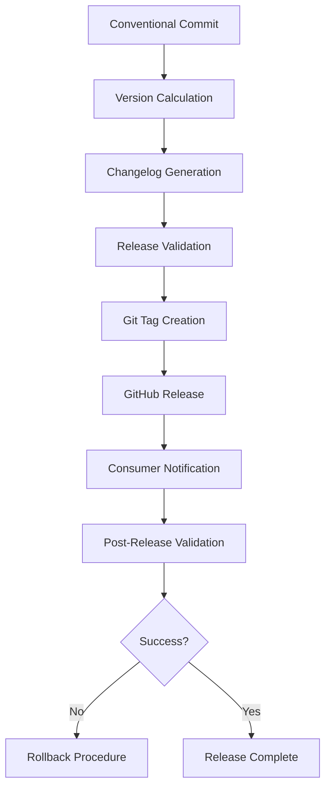

# Implementation Plan: Semantic Versioning and Release Automation

## Executive Summary

Implement a comprehensive semantic versioning and release automation system for Leyline that enables safe consumer adoption and migration. This plan prioritizes simplicity, automation, and practical consumer value while building on existing foundations (conventional commits, Ruby tooling).

## Technical Approach Analysis

### Approach Evaluation

**Considered Approaches:**

1. **GitHub Actions + semantic-release (Node.js)**
   - *Pros:* Mature ecosystem, extensive features, wide adoption
   - *Cons:* Introduces Node.js to Ruby project, potential tooling conflicts, overengineered for documentation repo
   - *Philosophy Alignment:* Violates "Simplicity First" - adds unnecessary complexity

2. **Pure Ruby solution with custom tooling**
   - *Pros:* Aligns with existing tooling, full control, minimal dependencies
   - *Cons:* Requires significant custom development, reinvents existing solutions
   - *Philosophy Alignment:* Violates "Don't Repeat Yourself" - changelog generation is solved

3. **Hybrid GitHub Actions + minimal tooling** ⭐ **SELECTED**
   - *Pros:* Simple, builds on existing foundations, practical, maintainable
   - *Cons:* Some custom scripting required
   - *Philosophy Alignment:* ✅ Simplicity First, ✅ Automation, ✅ Pragmatic

### Selected Architecture

**Core Components:**
1. **Version Determination Engine** - Analyzes conventional commits to determine semantic version bumps
2. **Release Orchestrator** - GitHub Actions workflow managing the release process
3. **Documentation Generator** - Creates changelog and migration guides
4. **Consumer Integration Testing** - Validates releases against sample consumers
5. **Rollback System** - Procedures and tooling for safe release rollbacks

## Detailed Implementation Plan

### Phase 1: Foundation Setup (Version Determination)

**Objective:** Establish semantic version calculation based on conventional commits

**Implementation Steps:**

1. **Create version calculation script** (`tools/calculate_version.rb`)
   - Parse git history since last release
   - Analyze conventional commit types (feat, fix, BREAKING CHANGE)
   - Calculate next semantic version (patch/minor/major)
   - Output: JSON with current version, next version, change type

2. **Integrate with existing Ruby tools**
   - Extend `tools/validate_front_matter.rb` to validate version fields
   - Update `tools/reindex.rb` to include version metadata
   - Ensure version consistency across all documentation

3. **Create release preparation script** (`tools/prepare_release.rb`)
   - Update VERSION file
   - Generate release metadata
   - Validate all documentation consistency
   - Run full validation suite

**Testing Strategy:**
- Unit tests for version calculation logic
- Integration tests with sample commit histories
- Validation against existing repository history

**Deliverables:**
- `tools/calculate_version.rb` with comprehensive test coverage
- Updated Ruby tooling with version support
- Test fixtures demonstrating version calculation scenarios

### Phase 2: Automated Changelog Generation

**Objective:** Generate structured changelogs from conventional commits

**Implementation Steps:**

1. **Extend version calculation to generate changelog**
   - Parse commit messages for user-facing changes
   - Categorize changes (Features, Bug Fixes, Breaking Changes)
   - Generate structured markdown output
   - Link to specific commits and issues

2. **Create changelog template system**
   - Template for consumer-focused change descriptions
   - Migration guide generation for breaking changes
   - Version comparison utilities

3. **Integrate with documentation structure**
   - Update CHANGELOG.md automatically
   - Generate version-specific migration guides
   - Create consumer notification templates

**Testing Strategy:**
- Test changelog generation with various commit scenarios
- Validate markdown formatting and links
- Integration tests with existing documentation structure

**Deliverables:**
- Enhanced `tools/calculate_version.rb` with changelog generation
- CHANGELOG.md template and update mechanism
- Migration guide templates

### Phase 3: GitHub Actions Release Workflow

**Objective:** Fully automated release process triggered by main branch merges

**Implementation Steps:**

1. **Create release workflow** (`.github/workflows/release.yml`)
   - Trigger on main branch push
   - Run full validation suite
   - Calculate version and generate changelog
   - Create Git tag and GitHub release
   - Update documentation with new version

2. **Implement release gates**
   - Require all CI checks to pass
   - Validate documentation consistency
   - Ensure no breaking changes without major version bump
   - Test against sample consumer configurations

3. **Create release notification system**
   - Generate GitHub release with detailed notes
   - Create consumer-friendly upgrade instructions
   - Link to migration guides for major versions

**Testing Strategy:**
- Test workflow in development branch
- Validate with dry-run releases
- Integration testing with GitHub API

**Deliverables:**
- Complete GitHub Actions release workflow
- Release validation and gate system
- Automated release notification templates

### Phase 4: Consumer Integration Support

**Objective:** Enable safe consumer adoption with migration support and testing

**Implementation Steps:**

1. **Create consumer testing framework**
   - Sample consumer configurations in `examples/`
   - Automated testing against common integration patterns
   - Validation of version pinning examples

2. **Develop migration guide system**
   - Automated generation of upgrade instructions
   - Breaking change impact analysis
   - Version compatibility matrix

3. **Create consumer CI/CD examples**
   - GitHub Actions workflows for consumers
   - Version pinning strategies
   - Automated update procedures

**Testing Strategy:**
- Real consumer integration tests
- Migration guide validation
- Version pinning verification

**Deliverables:**
- Consumer testing framework and examples
- Automated migration guide generation
- Complete CI/CD integration examples

### Phase 5: Rollback and Recovery Procedures

**Objective:** Safe rollback mechanisms for failed releases

**Implementation Steps:**

1. **Create rollback automation**
   - Script to revert Git tags and releases
   - Documentation version rollback procedures
   - Consumer notification for rollbacks

2. **Implement release validation**
   - Post-release verification checks
   - Consumer integration validation
   - Automated rollback triggers

3. **Document recovery procedures**
   - Manual rollback procedures
   - Consumer communication templates
   - Incident response workflow

**Testing Strategy:**
- Rollback procedure testing in development
- Validation of recovery mechanisms
- Consumer impact assessment

**Deliverables:**
- Complete rollback automation system
- Documented recovery procedures
- Incident response workflow

## Architecture Details

### Data Flow



### Module Interfaces

**Version Calculator Interface:**
```ruby
class VersionCalculator
  def initialize(repository_path, current_version)
  def calculate_next_version() # returns { current: "1.0.0", next: "1.1.0", type: "minor" }
  def generate_changelog(since_version) # returns structured changelog
  def validate_version_consistency() # validates all docs have consistent versions
end
```

**Release Orchestrator Interface:**
```yaml
# GitHub Actions Workflow Inputs
inputs:
  dry_run: boolean
  force_version: string
  skip_validation: boolean

# Outputs
outputs:
  version: string
  changelog: string
  release_url: string
```

### Security Considerations

1. **Secret Management**
   - GitHub token for release API access
   - No hardcoded credentials in scripts or workflows
   - Minimal permission scopes for automation

2. **Input Validation**
   - Validate all commit message parsing
   - Sanitize changelog content for injection attacks
   - Verify Git tag format and constraints

3. **Access Control**
   - Release workflow only triggers on main branch
   - Require PR reviews for release configuration changes
   - Protected branch rules enforce quality gates

### Configuration Management

**External Configuration Points:**
- `VERSION` file for current version tracking
- `.github/workflows/release.yml` for workflow configuration
- `examples/` directory for consumer integration examples
- Environment variables for GitHub API access

**No Hardcoded Values:**
- Release workflow parameters configurable
- Version calculation rules externalized
- Consumer examples templated

## Testing Strategy

### Unit Testing (tools/test_*)
- Version calculation logic with edge cases
- Changelog generation with various commit patterns
- Ruby tool integration points
- Error handling and validation

### Integration Testing
- End-to-end release workflow in development
- Consumer integration validation
- Documentation consistency checks
- GitHub API integration

### System Testing
- Full release cycle with sample consumer
- Rollback procedure validation
- Multi-version upgrade scenarios
- Performance under large commit histories

## Risk Assessment and Mitigation

| Risk | Severity | Probability | Mitigation |
|------|----------|-------------|------------|
| **Failed Release Deployment** | High | Medium | Comprehensive pre-release validation, rollback automation |
| **Consumer Breaking Changes** | High | Low | Migration guide generation, version compatibility testing |
| **Git History Corruption** | Medium | Low | Git tag validation, backup procedures |
| **Automation Failure** | Medium | Medium | Manual fallback procedures, monitoring |
| **Version Calculation Errors** | Medium | Low | Extensive unit testing, validation checks |
| **Consumer Integration Issues** | Medium | Medium | Sample consumer testing, documentation |

## Open Questions and Assumptions

### Questions Requiring Resolution:
1. **Initial Version**: What should be the first semantic version? (Suggest: 1.0.0)
2. **Breaking Change Policy**: How to define breaking changes for documentation? (Suggest: Removed/renamed tenets/bindings)
3. **Release Frequency**: Automated on every merge or scheduled? (Suggest: Every merge to main)
4. **Consumer Notification**: How to notify consumers of new releases? (Suggest: GitHub releases + optional webhook)

### Assumptions:
- Conventional commits are already enforced and reliable
- Ruby tooling environment is stable and preferred
- GitHub Actions is available and preferred CI/CD platform
- Consumers primarily integrate via Git submodules or direct file copying

## Implementation Timeline

**Week 1**: Phase 1 (Foundation Setup)
- Version calculation script
- Ruby tooling integration
- Initial testing framework

**Week 2**: Phase 2 (Changelog Generation)
- Changelog generation logic
- Template system
- Documentation integration

**Week 3**: Phase 3 (GitHub Actions Workflow)
- Release workflow creation
- Release gates implementation
- Notification system

**Week 4**: Phase 4 (Consumer Integration)
- Consumer testing framework
- Migration guide system
- CI/CD examples

**Week 5**: Phase 5 (Rollback Procedures)
- Rollback automation
- Recovery procedures
- Final validation and documentation

## Success Metrics

1. **Automation Coverage**: 100% of release steps automated
2. **Consumer Satisfaction**: Clear migration paths for all version changes
3. **Release Reliability**: < 1% rollback rate after implementation
4. **Documentation Consistency**: 100% version consistency across all documents
5. **Time to Release**: < 5 minutes from commit to release
6. **Consumer Integration**: Working examples for all major CI/CD platforms

## Next Steps

1. Create implementation branch: `git checkout -b feature/semantic-versioning-release-automation`
2. Begin Phase 1 implementation with version calculation script
3. Set up test environment with sample commit history
4. Establish validation criteria for each phase
5. Create progress tracking mechanism (GitHub project or issues)

This plan delivers a robust, simple, and highly automated semantic versioning system that enables safe consumer adoption while maintaining the project's commitment to simplicity and maintainability.
