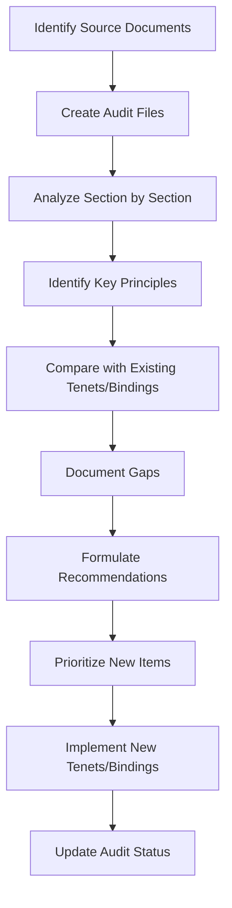

# Leyline Process Documents

This directory contains process documentation and templates for managing Leyline's tenets and bindings.

## Philosophy Coverage Audit

The audit process ensures that all principles and guidelines from source philosophy documents are properly represented in Leyline's tenets and bindings.

### Getting Started

1. **Understanding the Audit Process**:
   - Read `audit-template.md` to understand the format and approach
   - Review `sample-audit.md` for a concrete example

2. **Conducting an Audit**:
   - Copy the template for each source document you're auditing
   - Work systematically through the document, section by section
   - For each key principle, quote the source text and assess coverage
   - Identify gaps and make recommendations

3. **Using Audit Results**:
   - Create new tenets and bindings based on the gap analysis
   - Update existing tenets/bindings to improve coverage
   - Use audits as documentation for why certain tenets/bindings exist

### Audit Workflow

### Audit Checklist

- [ ] Identify all source philosophy documents
- [ ] Create audit files for each document
- [ ] Complete initial analysis of all documents
- [ ] Compile gap analysis summary
- [ ] Prioritize creation of missing tenets/bindings
- [ ] Implement high-priority missing items
- [ ] Implement medium-priority missing items
- [ ] Implement low-priority missing items
- [ ] Final review to ensure complete coverage

## Maintaining Process Documentation

As Leyline evolves, these process documents should be updated to reflect current best practices. Suggest improvements via pull requests.